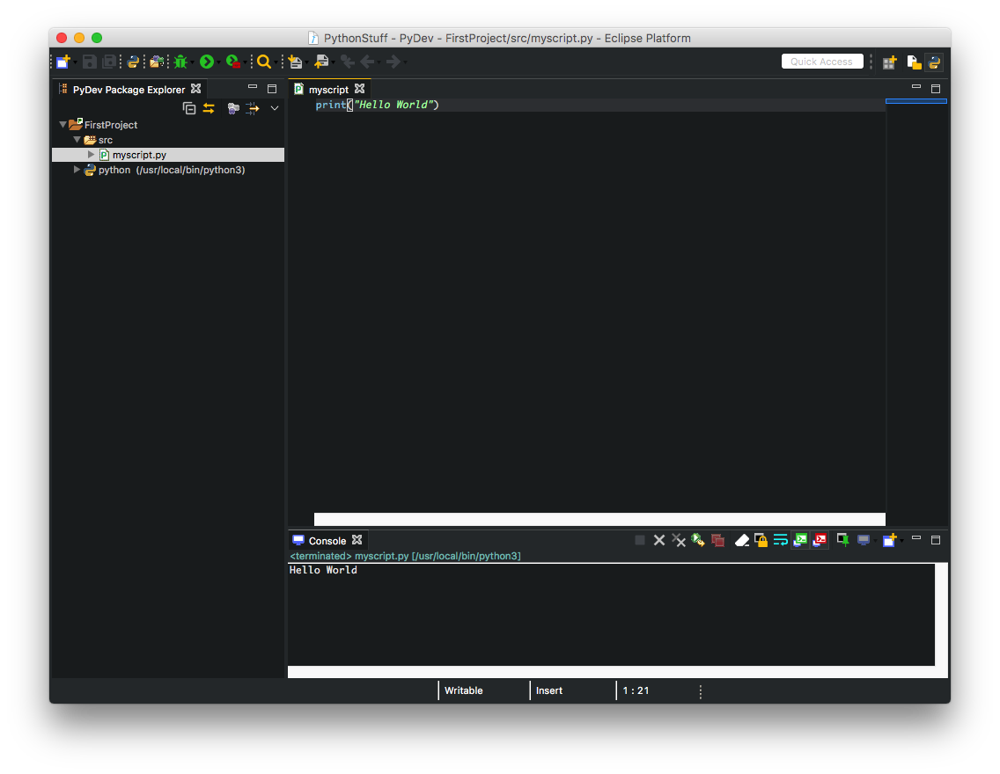

# Darkest Dark Theme

By default, `Eclipse` has a white and light gray theme. You can change the theme in the `Preferences` menu to a darker theme.

There's an alternative to the builtin dark theme named `Darkest Dark Theme` which looks nicer and helps with the eye strain in those late night coding sessions.

To install it you need to open the `Help` menu and select `Eclipse Marketplece...`

This plugin has a small bug that can be workarounded by installing another plugin.

In the search box type the letters `wst` and press `Enter`.

Click the `Install` button on the `Eclipse Web Developer Tools`.

In the next step you can select which extra packages do you want such as `Git` integration.

If you don't need them you can leave them unchecked. Once you have accepted the licenses and the plugin has installed you will need to restart `Eclipse` when prompted.

Open again the `Eclipse Marketplace`, then type in the search box `darkest` and press `Enter`, the `Darkest Dark Theme` should be the first item on the results list.

Click the `Install` button, you will be required to accept the licenses and restart `Eclipse` once it has finished installing.

When `Eclipse` has restarted you should have an `IDE` looking like in the following image.

