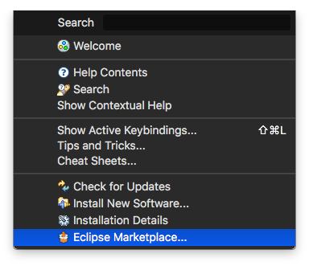
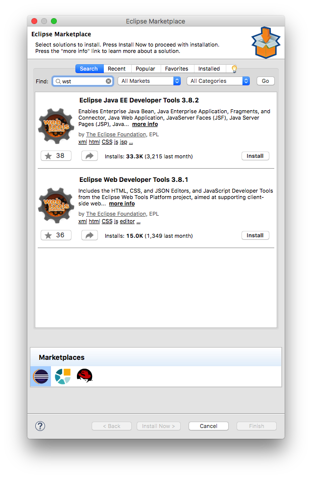
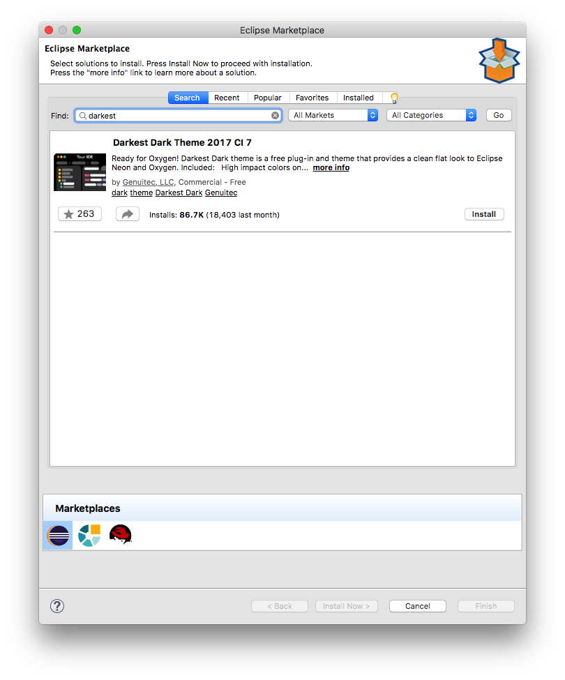

# Darkest Dark Theme

Note: At the moment of writing this guide there's a small bug using this plugin. When a fix for the bug is found this notice will be removed.

By default, `Eclipse` has a white and light gray theme. You can change the theme in the `Preferences` menu to a darker theme.

There's an alternative to the builtin dark theme named `Darkest Dark Theme` which looks nicer and helps with the eye strain in those large coding sessions.

To install it you need to open the `Help` menu and select `Eclipse Marketplece...`

You will notice that the `Darkest Dark Theme` is very popular and it's the first item you will see on the `Eclipse Marketplace`.

Press the `Install` button, you will be required to accept the licenses and restart `Eclipse` once it has finished installing.

When `Eclipse` has restarted you should have an `IDE` looking like in the following image.

