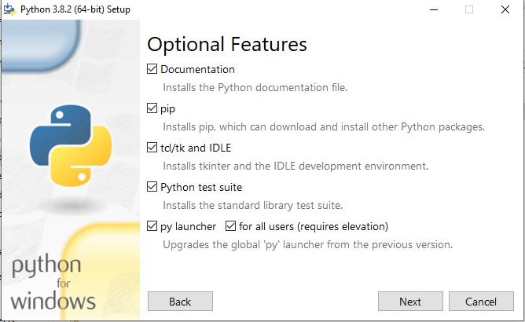

# Install Python

Python is available for several operating systems and architecture combinations. These guides are focused on `Python 3` only.

## Windows

The easiest way to install `Python 3` on `Windows` is to use the official `Python 3 Installer`.

You can download the installer file (`.exe`) by opening the following link on a `Windows` PC.

https://www.python.org/downloads/

When running the installer make sure to check the box that says `Add Python 3.6 to PATH`.

Once `Python 3` has finished installing you will be able to run `Python 3` scripts by opening a `Command prompt` and typing the name of the file.

Assuming we have a simple `Python 3` file on our desktop named `myscript.py`:

```
cd c:\Users\(username)\Desktop
myscript.py
```

## OSX / macOS

The easiest way to install `Python 3` on `OSX` and `macOS` is to use the package manager `Homebrew`.


Open a terminal window and enter the following commands:

```
brew update
brew install python3
```

If you don't have `Homebrew` installed you can install it by entering the following command in a terminal:

```
/usr/bin/ruby -e "$(curl -fsSL https://raw.githubusercontent.com/Homebrew/install/master/install)"
```

Once `Python 3` has installed, you can verify it is correctly linked to your `PATH` by using the following command:

```
python3 --version
```



# Linux (Ubuntu)

The easiest way to install `Python 3` on `Ubuntu` is by using the built in package manager.

Open a terminal window and enter the following commands:

```
sudo apt-get update
sudo apt-install python3
```

Once `Python 3` has installed, you can verify it is correctly linked to your `PATH` by using the following command:

```
python3 --version
```