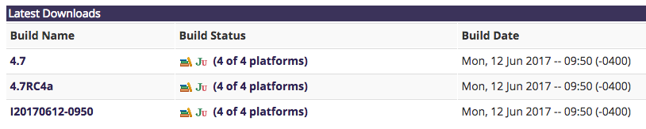
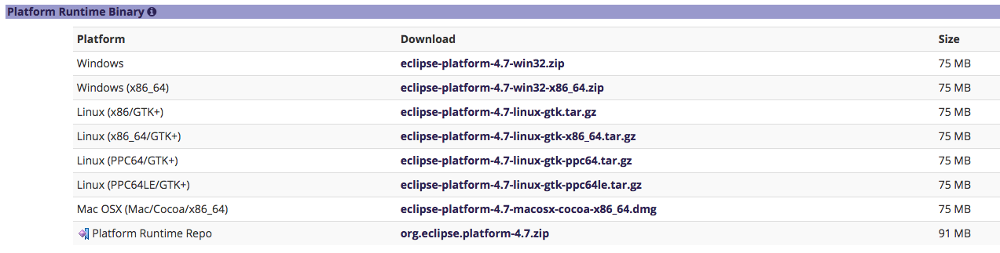
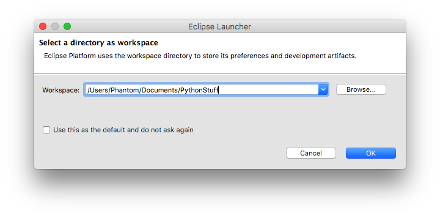
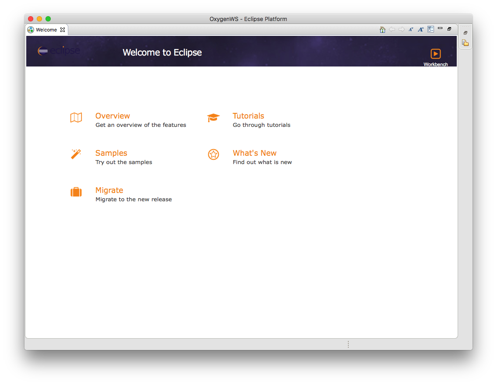

# Install Eclipse

The `Eclipse IDE` has distributions for several programming languages. In this guide we are going to download a special version of Eclipse that isn't bundled with any programming language plugin so it will load very fast and will be light on resources.

First, we need to open the following link: http://download.eclipse.org/eclipse/downloads/

You will be presented with a small table where you can select a version.

These values may change in a future, once you have selected a version a new page will open with detailed information about the version you selected.

Scroll down in the page until you reach the table that says `Platform Runtime Binary`

Once you have selected the distribution for your platform, download it and extract it in your computer, it is recommended to save it in a safe location where it can't get deleted by accident.

Execute the Eclipse executable, you will be asked to type the path of your default workspace.

After you have defined your workspace you will be presented with the Eclipse welcome screen.

You have successfully installed Eclipse and it's now ready to be customized with external plugins.

