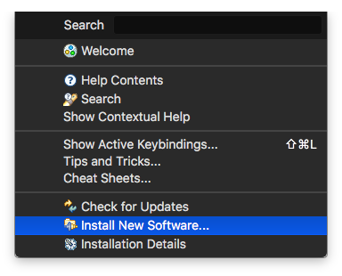
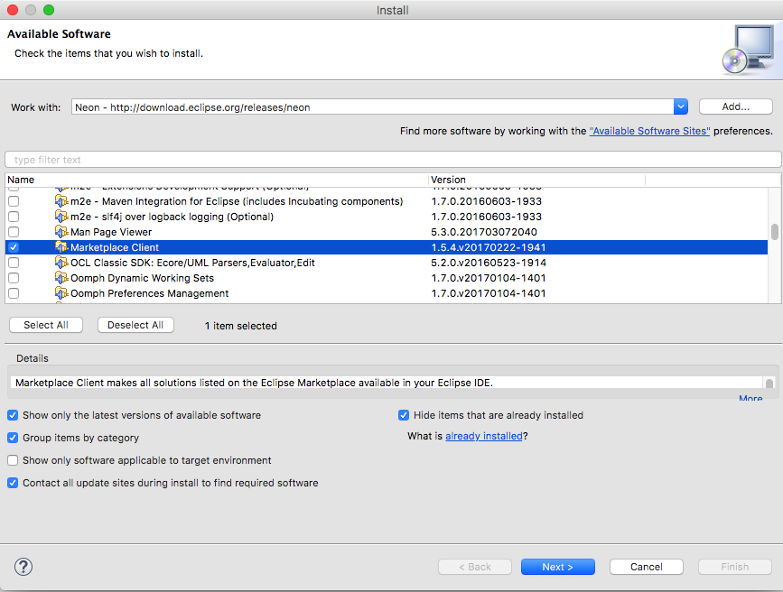
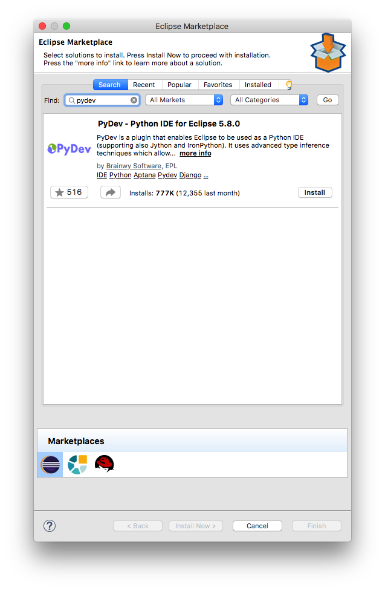
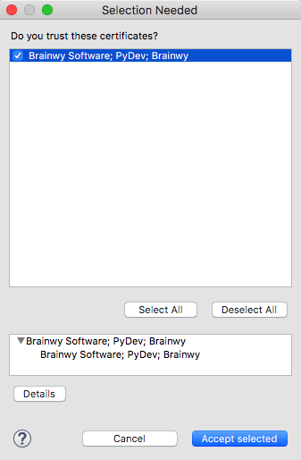
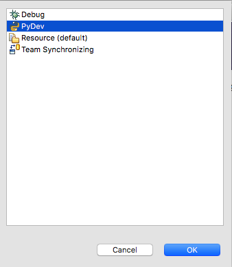

# Install PyDev

Now that your `Eclipse` installation is complete, it's time to install `PyDev`.

Open the `Help` menu and select `Install New Software`. 

A new window will open where you can select where do you want to fetch information about extra packages.

Next to the text that says `Work with` there's a drop down where you can select a repository of packages.

If you have downloaded `Eclipse Oxygen`, select `Oxygen`, a list of available packages will begin to load.

Once the list has finished loading, locate the `General Purpose Tools` node and expand it. Then tick the `Marketplace Client` box and click the `Next` button at the bottom.

The installation process will start, you must accept the license agreements to continue. After the `Marketplace Client` has finished installing you will be asked to restart `Eclipse`, restart it.

Open again the `Help` menu and select the new option `Eclipse Marketplace...`

The `Eclipse Marketplace` window will open, in the search box type `pydev` and press `Enter`.

Click the `Install` button and continue with the installation process, it will also ask you to accept the license agreements to continue.

At some point during the installation process you will be asked to trust a certificate. It is very important to check the box and click the `OK` button, otherwise the installation will not succeed.

After `PyDev` has finished installing it will ask you to restart `Eclipse`, restart it.

To enable the `PyDev` plugin you need to change the IDE perspective.

Open the `Window` menu, select `Perspective` -> `Open Perspective` -> `Other...`

Select the `PyDev` perspective and click the `OK` button.

`PyDev` is almost ready to be used, in the next guide we will configure a default interpreter and our first projeet.
