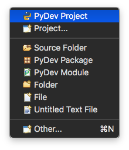
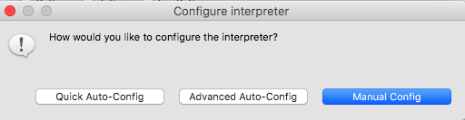
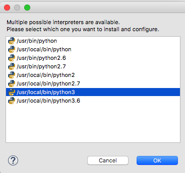
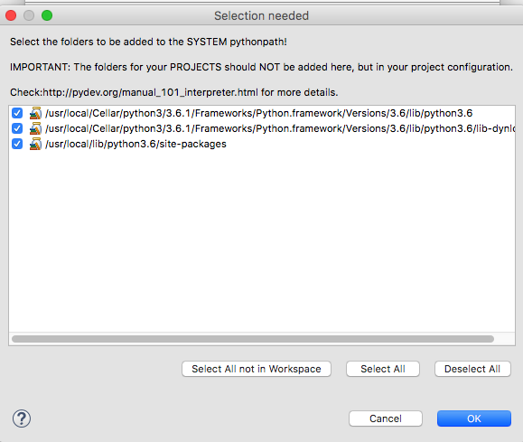
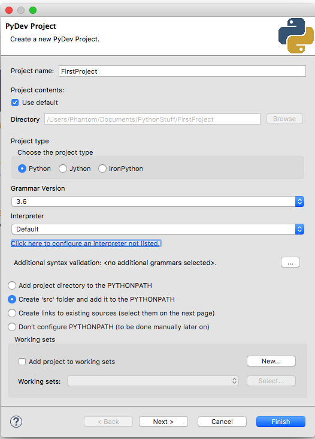

# Configure PyDev

Now that `PyDev` is enabled we are going to configure our first project.

Open the `File` menu and select `PyDev Project`.

A window will open where you can customize your project properties, first let's give a name to our project.

For `Project Type` select `Python`.

For `Grammar Version` select `Python 3.6`

You will then notice that `PyDev` is asking to configure a `Python` interpreter. Click on the underlined text.

Press the `Advanced Auto-Config` button.

`PyDev` will now start scanning your computer for all your valid `Python` interpreters.

Your results will change depending on your operating system and which versions of `Python` you have previously installed.

In my case I choose `/usr/local/bin/python3` which is linked to the default `Python 3` interpreter on my machine (`Python 3.6.1)`. In this case it would have been the same as choosing `/usr/local/bin/python3.6`.

Now you will be asked to select which folders need to be added to the `SYSTEM` pythonpath. Tick all boxes and press `OK`.

You have successfully configured the default `Python` interpreter. This interpreter will be available for this and future projects as the `Default` option.

Finally, select how your project should be linked. As a personal preference I choose the `Create 'src' folder and add it to PYTHONPATH` since it is easier to organize.

On the next guide we will run our first `Python 3` script.

