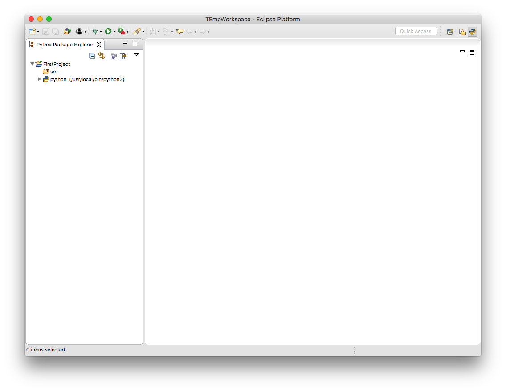
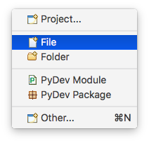
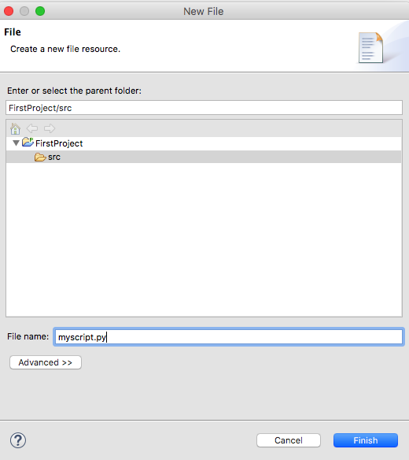
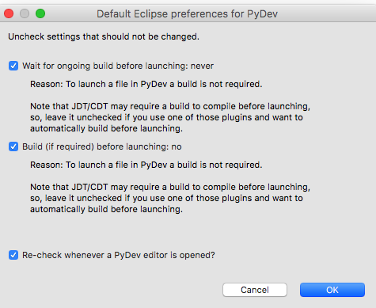
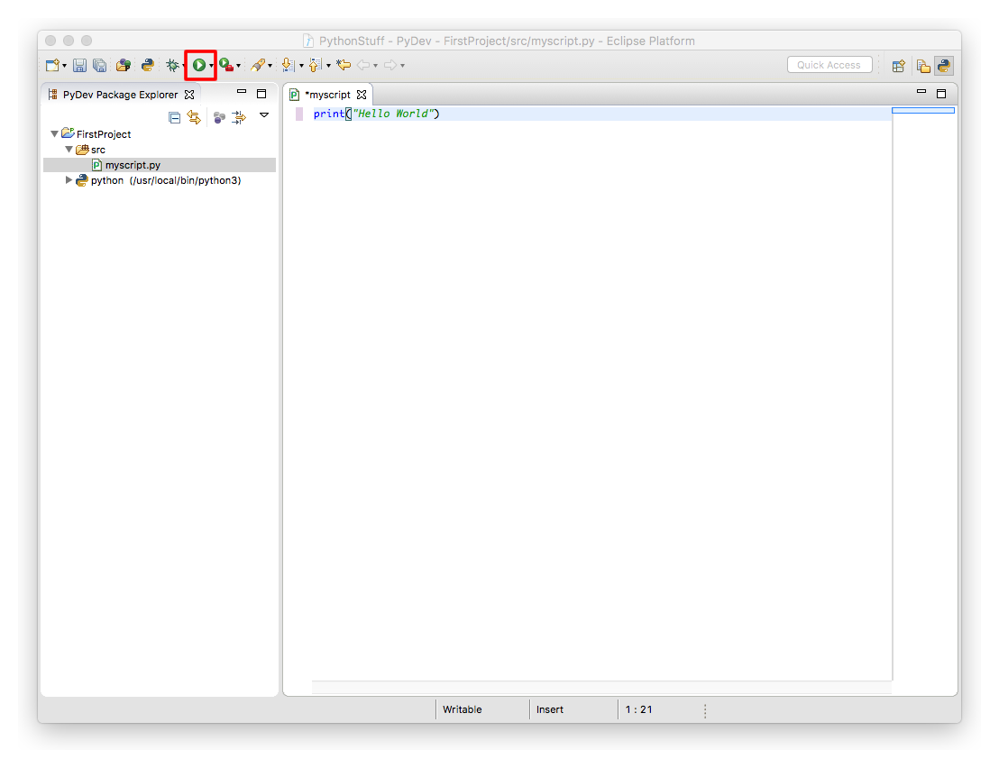
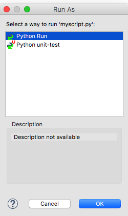
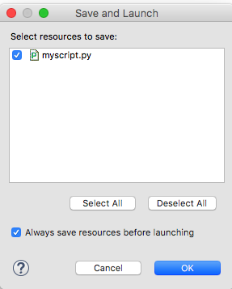
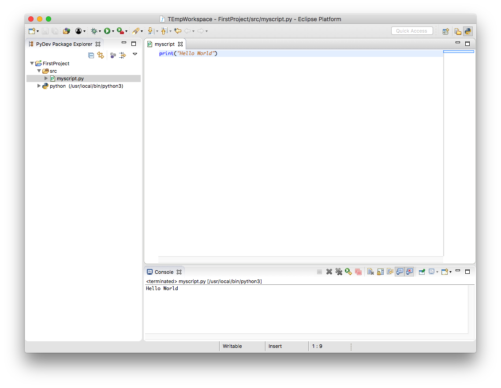

# Running your First Script

After you have created your first project and configured the default `Python` interpreter you should be presented with a screen similar to this one:



To create your first script you first need to create a `.py` file.

Right click the `src` folder and select `New` -> `File`.



When naming your file avoid using the word `test`, since it may cause conflicts with the builtin `test` module. 



Once you have created your file a window will appear asking for your `PyDev` preferences. Since we are developing simple scripts we can leave it as is and press `OK`.



The new `.py` file will be opened on the right side. Type the following code and then press the green button on the top that has a Play icon. Alternative you can press `F9` to run your script.

```python
print("Hello World")
```



A window will appear asking how do you want to run the script, select `Python Run`.



Another window will appear asking to save your file before running, check the box that says `Always save resources before launching` and press `OK`.



The script will now run and you will see the output of the `print` statement at the bottom of the screen.



Congratulations! Now you are all set to run any `Python 3` script.
